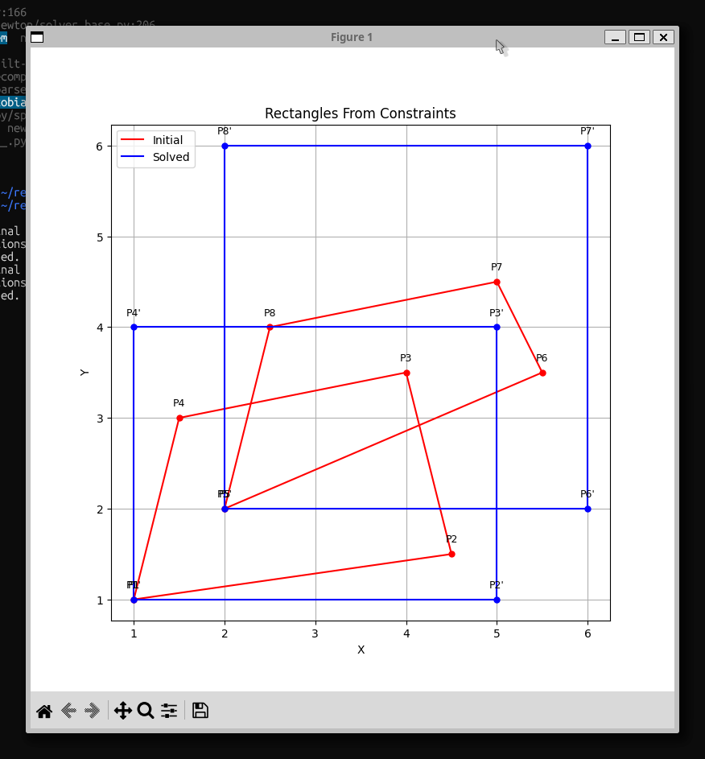
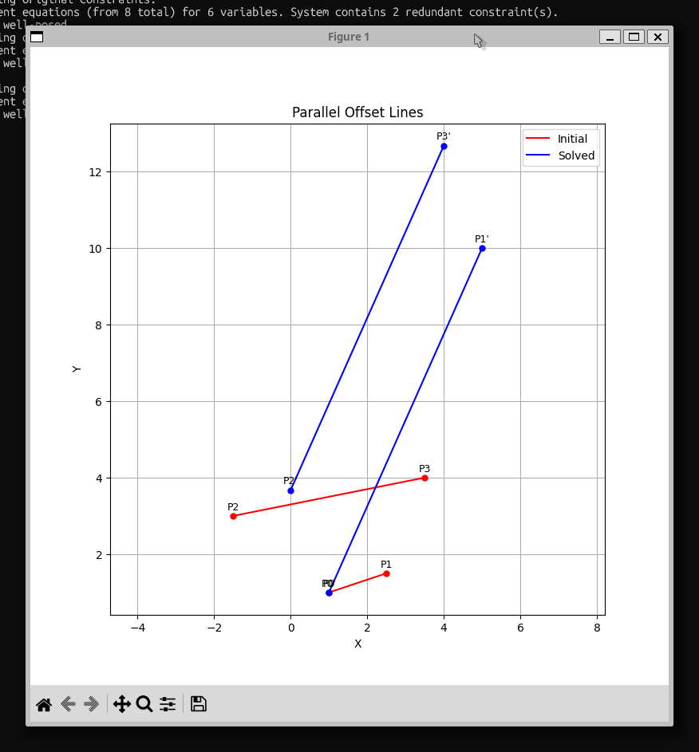
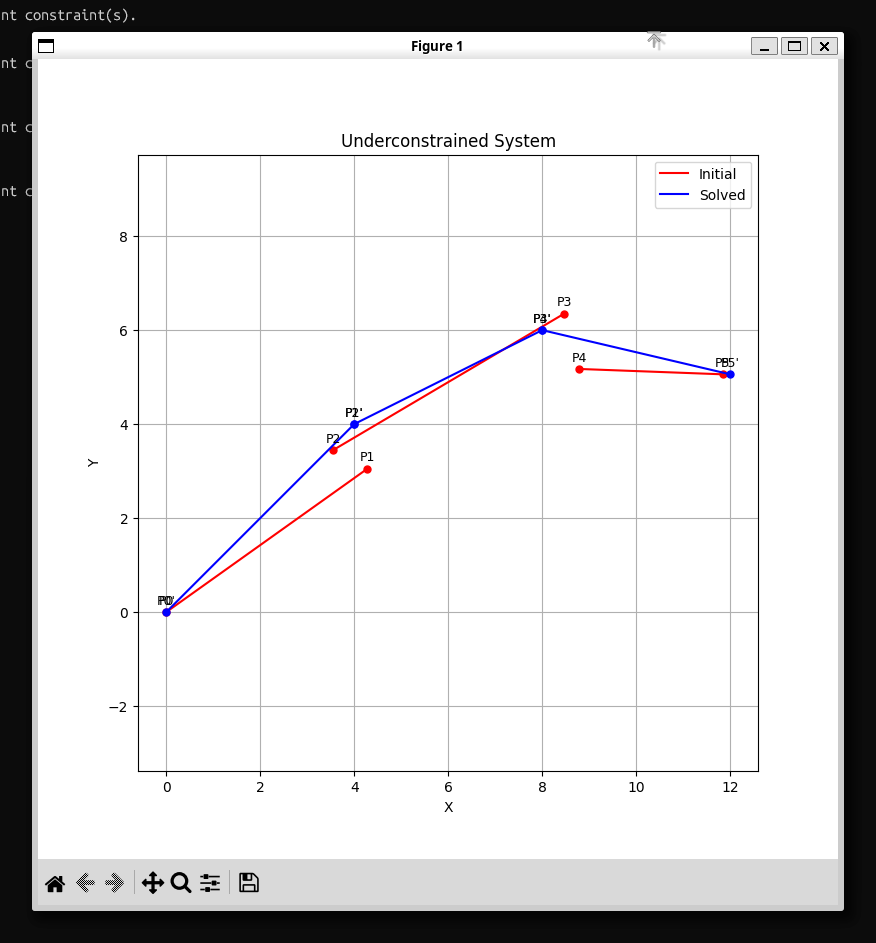
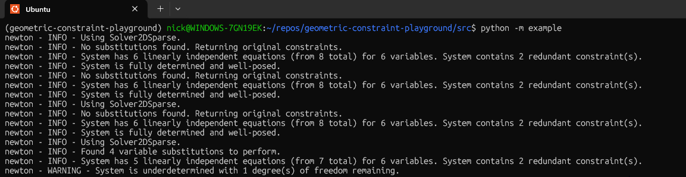

# geometric-constraint-playground

This repo contains experimental code for exploring geometric constraint solving problems. It is not
intended for production use; it is intended to be used to help establish which approaches are most
effective for solving the sort of problems we expect to encounter within the sketcher.

## Problem

The problem is to solve a set of geometric constraints, e.g.,

- 'Point A and Point B are coincident.'
- 'Line L1 is parallel to Line L2.'
- 'Circle C1 is tangent to Circle C2.'

Practically, this problem is solved via numerical methods. For each constraint, we derive a residual
function that returns how distant from being satisfied the constraint is. For example, for a
distance constraint, the residual would be `current_distance - target_distance`. When all
constraints are satisfied, all residuals will be zero (within some tolerance).

For the exactly determined case (locally as many independent constraints as degrees of freedom), this forms
a multivariate root-finding problem for which we can use Newton's method to find the variable values that make all residuals zero.

In practice, we often have more constraints than degrees of freedom (overdetermined) or fewer constraints than degrees of freedom (underdetermined).

The underdetermined case is particularly common in cases like a 2D sketcher, where the user's progressive
application of constraints may leave several degrees of freedom remaining as the constraint system
is built up. In this case, we can adjust our problem to achieve a minimum-norm step that
satisfies the constraints.

For the overdetermined case, we typically want to report an error to the user, but we can also
solve a least-squares problem to find the best-fit solution that minimises the sum of squared
residuals. This solution may also be useful in helping diagnose conflicting constraints.

In all cases, non-linear constraints are common, so we need to use a non-linear solver. The standard
approach is to use a variant of Newton's method that iteratively linearises the problem around
the current guess and solves a linear subproblem to compute an update step. This is repeated until
convergence.

## Structural optimisation

The solve can be 'structurally' optimised in two ways that we care about:

- **Separating decoupled systems:** In graph terms, this is finding the connected components of the
  constraint graph. If the graph separates into multiple components, we can solve each smaller
  system independently, which is more efficient.
- **Symbolic variable substitution:** For equality constraints like 'Point A is coincident with
  Point B', we can eliminate one of the variables from the problem entirely. All references to Point
  B's coordinates can be replaced with references to Point A's coordinates, reducing the total
  number of variables the solver must handle.

In addition, sparse solvers can exploit structure via fill-reducing orderings (e.g., AMD/COLAMD)
and naturally take advantage of sparsity in the Jacobian.

### Quasi-independent subsystems

I spent a lot of cycles trying to identify ways to partition quasi-independent subsystems (i.e.,
block triangular decomposition of the Jacobian). For example, with this sort of system:

```
3x + y = 11
2x + y = 8
4x + 2y - z = 11
```

Which in matrix form would be:

```
[3 1 0]  [x]   [11]
[2 1 0]  [y] = [8]
[4 2 -1] [z]   [11]
```

It is possible to partition the system into two quasi-independent subsystems. First solve for x
and y, then substitute those values into the third equation to solve for z.

```
[3 1 0] [x] [11]
[2 1 0] [y] = [8]
```

Then:

```
4x + 2y - z = 11
12 + 4 - z = 11
-z = -5
```

Which in matrix form would be:

```
[-1] [z] = [-5]
```

(See: `scratch/system_partitioning.py` for this particular example.)

However, finding and applying a general decomposition (e.g., Dulmage–Mendelsohn) is complex and, in
practice, seems to offer little benefit over a modern sparse solver that already
exploits sparsity and partial decoupling.

This highlights the importance of using a suitable solver: a good one will make
significant use of zeros and structural aspects without requiring us to perform bespoke partitioning.

## Solve method

The core of the solver currently uses `scipy.optimize.least_squares` with the Trust Region
Reflective (`trf`) algorithm, because it plays nicely with a sparse Jacobian. Other choices
(Gauss–Newton, Levenberg–Marquardt, or quasi-Newton) are also viable when they have good sparse
support, but our frame of reference should be Newton's method.

Note that our sparse requirement really originates from how our constraints typically
only involve a few variables, leading to a very sparse Jacobian. For example, a sketch
composed of many points and lines often involve numerous constraints which refer only to the X and Y
coordinates of a handful of points, but we may have dozens of points in total.

As a result, we have a system with many variables and many equations, but often no relationship
between a given equation and most of the variables. This leads to a Jacobian matrix that is mostly
zeros, which we can exploit for efficiency.

### Newton's method

In its simple form, Newton's method can be described by:

$$J \Delta x = -F(x_n)$$

Where:

- $J$ is the Jacobian matrix of partial derivatives of the residuals with respect to the variables, $J_F(x_n)$.

This is multivariate Newton’s method in its standard linearised form, and can be directly
related to the one-dimensional case:

$$
x_{n+1} = x_n - \frac{f(x_n)}{f'(x_n)},
$$

Where the step size, $\Delta x$, is $x_{n+1} - x_n$.

This can be rearranged to:

$$\Delta x = - \frac{f(x_n)}{f'(x_n)}$$

Moving to multiple dimensions, $f'(x_n)$ becomes the Jacobian, $J$, and $f(x_n)$ becomes the residual vector $F(x_n)$, leaving:

$$
J \Delta x = -F(x_n).
$$

At each iteration, we then update:

$$
x_{n+1} = x_n + \Delta x.
$$

Notes:

- $\Delta x$ is a vector increment (an update step), not a derivative.
- This is an $A x = b$-like solve at each iteration.
- $F(x)$ is the stacked residual vector (one entry per constraint), not a sum of residuals.

### Notes on Gauss–Newton

Newton's method as described above is suitable for exactly determined systems (locally as many
independent constraints as degrees of freedom). In practice, we often have underdetermined or
overdetermined systems for which this approach will not work directly.

[Gauss-Newton](https://en.wikipedia.org/wiki/Gauss%E2%80%93Newton_algorithm) is an extension
of Newton's method that can handle these cases by effectively minimising the sum of squared residuals.

The basic idea is to introduce [normal equations](https://mathworld.wolfram.com/NormalEquation.html)
to transform the problem into a form that can be solved even when the system is not exactly determined. In this way:

$$
J \Delta x = -F(x_n).
$$

Becomes:

$$J^\top J \Delta x = -J^\top F(x_n)$$

### Underdetermined case

To handle underdetermined systems, we use Tikhonov regularisation with the Gauss–Newton formulation, adding magic regularisation terms to the diagonal:

$$
(J^\top J + \lambda^2 I)\,\Delta x = -J^\top F(x_n).
$$

This stabilises the step and yields a minimum-norm step when degrees of freedom exist. If we also want to stay near a reference state $x_{\mathrm{ref}}$ (e.g., the initial sketch), we can add an anchor term, giving:

$$
(J^\top J + \lambda^2 I)\,\Delta x = -J^\top F(x_n) - \lambda^2 (x_n - x_{\mathrm{ref}}).
$$

Note that what we're doing here is closely related to the Levenberg–Marquardt algorithm.

### Overdetermined case

For overdetermined systems, we can solve the least-squares problem:

$$
\min_x \|F(x)\|_2^2
$$

Again, this can be solved via the Gauss–Newton formulation:

$$
J^\top J \Delta x = -J^\top F(x_n)
$$

Many solvers will handle this transition from exactly determined to under or overdetermined automatically.

### Additional considerations

- Rank estimation and problem state.

  - Before solving, we estimate the rank of $J$ (via SVD or QR) to characterise the system.
    Rank (rather than raw counts) can be used to separate underdetermined systems from those which are exactly or overdetermined.
    However, identifying truly overconstrained systems is more complex.
  - See: https://github.com/KittyCAD/ezpz/issues/6#issuecomment-3215292050

- Residual scaling.
  - Different constraints have different units and magnitudes (e.g., angles vs. distances). We
    should consider scaling residuals to balance their influence on the solution.

## Todos and caveats for the reader

- Solver choice.
  - The codebase includes both a sparse solver (manual Jacobians) and a dense
    solver (using JAX for autodiff). We expect sparse methods to dominate for scale; we should
    continue to index on sparse Jacobians and good fill-reducing orderings.
  - SymPy was used extensively to derive manual derivatives; see `derivative_deriver.py`.
- Scaling & units.
  - Add per-residual weights or automatic scaling to balance constraints of
    different magnitudes (angles vs. distances).
- Diagnostics.
  - Better reporting of sketch state, estimation of DOFs, rank, etc.

## Usage

To get set up with the project, you need [uv](https://docs.astral.sh/uv/).

This is wholly untested but I think the setup should be something like:

```bash
cd geometric-constraint-playground
uv sync
```

Then, to run the example in the virtual environment:

```bash
source .venv/bin/activate
cd src
python -m example
```

There are currently a range of example functions in `example.py`. These include:

- `constrain_rectangles()`: Constrains two rectangles; these are wholly decoupled systems and the
  solver should identify two independent subsystems.
- `constrain_parallel_offset()`: Constrains two lines to be parallel and offset by a fixed distance.
- `constrain_underdetermined()`: Constrains a sort of arm linkage, with its final point being
  underdetermined. The solver should arrive at a minimum-norm solution that is closest to the
  initial guess.
  - This system also allows for symbolic substitution of the final point, which should be reported
    if a suitably noisy log level is set.

For the time being, modify `example.py` to choose which functions are called and whether to plot the
results.

Additionally, `constants.py` contains configuration options that you can modify to change the
solver's behaviour, such as whether to use a sparse or dense solver, whether to use symbolic
substitution, and the convergence tolerance for the solver.







Note the mention of symbolic substitution in the log output of the `constrain_underdetermined()`
example:


